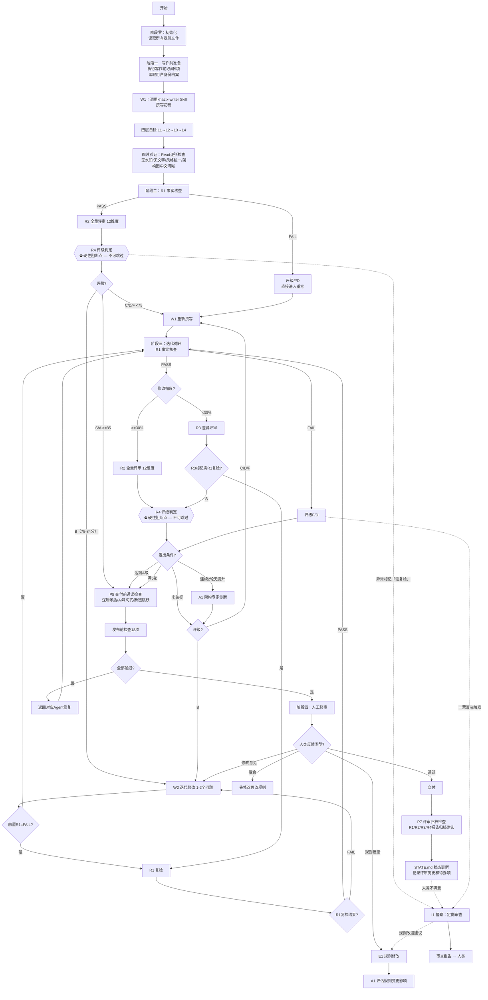

# 主Agent编排流程图

## 总览

本文档描述 KZCQL 系统中主 Agent 的完整编排流程，涵盖从初始化到最终交付的全部阶段。主 Agent 作为"薄编排器"，负责协调各子 Agent 和 Skill 的调用，确保写作质量闭环。

---

## Mermaid 流程图

---

## 六个阶段详细说明

### 阶段零：初始化

主 Agent 启动后的第一步，完成系统状态的准备工作：

- **读取所有规则文件**：加载 `01_共享知识库/` 下的前置撰写规则、后置评审规范、评分体系、一票否决项等全部规则文件。
- **读取子 Agent 规范**：加载 `02_子Agent规范/` 下各子 Agent 的行为规范和职责定义。
- **检查工作区状态**：确认 `04_工作区/` 下是否有待处理的原始材料或待评文章。
- **读取历史上下文**：如有 STATE.md 或 MEMORY.md，恢复上次会话的关键决策和进度。

### 阶段一：写作前准备

在调用写作 Skill 之前，主 Agent 必须完成以下准备：

1. **执行写作前必问5项**（详见 `01_共享知识库/前置撰写规则/前置撰写规则.md`）：
   - 确认文章主题和核心观点
   - 确认目标读者和发布平台
   - 确认文章风格和语气
   - 确认素材来源和引用要求
   - 确认交付时间和格式要求

2. **读取用户身份档案**：获取用户的写作风格偏好、历史文章特征、品牌调性等信息，作为 khazix-writer Skill 的输入参数。

### 阶段二：首轮评审

初稿完成后，进入首轮评审流程：

1. **四层自检（L1→L2→L3→L4）**：由写作 Agent 自行执行的四层质量检查，详见 `02_子Agent规范/写作组/初稿撰写Agent.md`。
2. **图片验证（ImageCheck）**：使用 Read 工具逐张检查所有生成的图片。检查项：无水印、无文字/品牌名、风格统一、架构图中文清晰。不通过则重新生成不合格图片后再次验证，通过则进入 R1 事实核查。
3. **R1 事实核查**：由事实核查 Agent 对文章中的事实性陈述进行逐一核查。
   - **FAIL**：评级为 F 或 D，直接跳过后续评审，进入重写流程。
   - **PASS**：进入 R2 全量评审。
3. **R2 全量评审**：由全量评审 Agent 从 12 个维度对文章进行全面评审。
4. **R4 评级判定**：根据评审结果给出综合评级（S/A/B/C/D/F）。

### 阶段三：迭代循环

根据 R4 评级结果，进入不同的处理路径：

- **S/A 级（>=85分）**：直接进入人工终审。
- **B 级（75-84分）**：调用迭代修改 Agent（W2），针对 1-2 个核心问题进行定向修改。
- **C/D/F 级（<75分）**：调用初稿撰写 Agent（W1），重新撰写全文。

修改完成后重新进入 R1 事实核查，根据修改幅度选择评审路径：
- 修改幅度 >=30%：走 R2 全量评审。
- 修改幅度 <30%：走 R3 差异评审（仅评审修改部分）。

### 阶段四：人工终审

文章达到 A 级或满足退出条件后，提交给人类审阅。人类反馈分为四种类型：

- **通过**：文章交付。
- **修改意见**：返回 W2 迭代修改。
- **规则反馈**：触发 E1 规则修改流程。
- **混合**：先执行修改，再执行规则变更。

### 阶段五：规则演进（条件触发）

当人类反馈涉及规则层面的调整时：

1. **E1 规则修改**：由规则修改 Agent 执行规则变更。
2. **A1 评估规则变更影响**：由架构专家 Agent 评估变更对现有规则体系的影响，确保一致性。

### 阶段六：交付

文章通过所有评审和人工确认后，执行交付：

- 将最终版本保存至 `04_工作区/产出归档/YYYYMMDD_{文章关键词}/稿件/`。
- 评审报告已保存在同一归档的 `评审/` 子目录中。
- 更新 STATE.md 记录本次会话的关键决策。

---

## 关键决策节点说明

| 决策节点 | 判断依据 | 后续动作 |
|----------|----------|----------|
| R1 事实核查 | 事实性错误数量和严重程度 | PASS→R2 / FAIL→重写 |
| R4 评级判定 | 12维度综合评分 | S/A→人工终审 / B→W2 / C/D/F→重写 |
| 修改幅度判断 | 修改内容占全文比例 | >=30%→R2 / <30%→R3 |
| 人类反馈类型 | 审阅者的反馈性质 | 通过/修改/规则/混合 |
| 退出条件检查 | 迭代轮次和评级变化 | 达标→人工终审 / 未达标→继续迭代 |

---

## 迭代循环的退出条件（3级优先级）

迭代循环设有严格的退出机制，按优先级从高到低：

1. **P0（最高优先级） - 达到A级（>=85分）**：文章评级达到 A 级（>=85分），自动退出迭代循环，进入人工终审。这是正常的质量达标退出。
2. **P1（中优先级） - 连续2轮无提升**：如果连续两轮迭代评级未提升，调用 A1 架构专家诊断，分析根本原因后决定后续策略。此条件防止无效循环。
3. **P2（兜底优先级） - 满5轮**：无论评级如何，迭代满 5 轮后强制退出，进入人工终审。此条件防止无限迭代，确保人类能在合理时间内介入。

---

## khazix-writer Skill 在流程中的位置和作用

**调用位置**：阶段一完成准备后，在阶段二的 W1（初稿撰写）环节调用。

**作用**：
- khazix-writer Skill 是初稿生成的核心引擎，负责将用户需求、素材和身份档案转化为高质量的长文初稿。
- 主 Agent 在调用时传入以下参数：文章主题、目标读者、风格要求、素材路径、用户身份档案。
- Skill 输出的初稿将直接进入四层自检和 R1 事实核查流程。
- 在重写场景（W1Rewrite）中，khazix-writer Skill 会接收上一轮的评审反馈作为额外输入，避免重复相同问题。

**与其他组件的关系**：
- 上游：接收阶段一的准备结果（5项确认 + 身份档案）。
- 下游：输出初稿给四层自检机制。
- 旁路：在迭代循环中，评审反馈会回流到 Skill 的输入参数中。

---

## 四层自检与评审闭环的关系

四层自检（L1→L2→L3→L4）是写作 Agent 内部的质量保障机制，评审闭环（R1→R2/R3→R4）是外部的独立评审机制。二者形成"内检+外审"的双重保障：

| 维度 | 四层自检 | 评审闭环 |
|------|----------|----------|
| 执行者 | 写作 Agent（自我检查） | 评审专家组（独立评审） |
| 触发时机 | 初稿完成后立即执行 | 自检通过后执行 |
| 检查范围 | 基础规范、逻辑连贯、语言质量、格式合规 | 事实准确性、12维度全面评审 |
| 纠错能力 | 可直接修改后重新自检 | 仅给出评审意见，修改由写作/迭代 Agent 执行 |
| 权威性 | 内部参考 | 外部裁决（决定评级和走向） |

**闭环逻辑**：四层自检确保初稿达到"可评审"的基本标准，评审闭环则确保文章达到"可交付"的质量标准。如果自检未通过，文章不应进入评审闭环，避免浪费评审资源。
