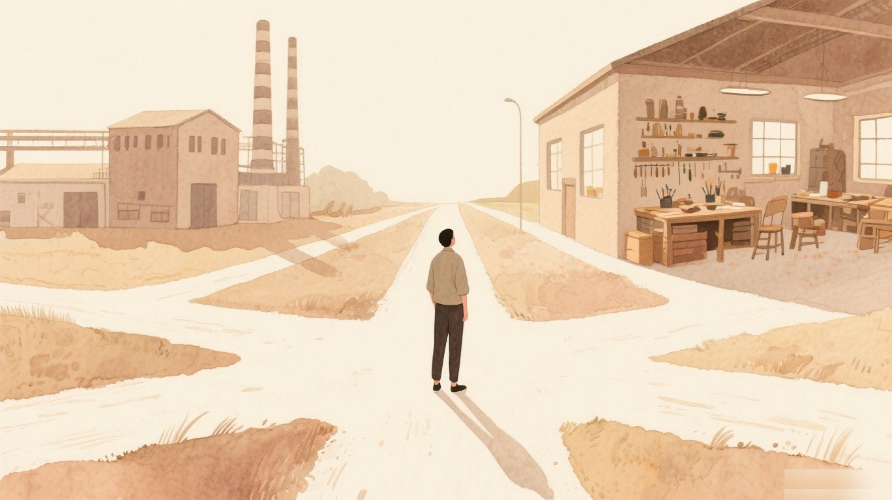

# 从项目到内容，我的经验差点烂在硬盘里

前年冬天，我接手了一个项目。

代码库里堆着六百多个bug，没人知道从哪下手。我花了整整两天，和AI搭档一起排查、定位、修复。最后，bug量从六百多降到了近乎为零。

听起来挺有成就感的对吧。

但我当时最大的焦虑，根本不是技术难度。而是这件事做完之后，我能留下什么。

你懂的，那种感受。一个项目结束了，bug修完了，系统也稳定了。然后呢？然后这些排查经验就像水一样流走了。除了代码库里几行commit记录，好像什么都没剩下。

我当时就在想，有没有办法，把这些项目经验变成能持续产生价值的东西。

不是写一份技术文档扔在Wiki里吃灰。而是真正能帮到别人、能建立影响力、能变成个人资产的内容。

这个想法，后来成了我做KZCQL系统的起点。

---

很多人有经验，但不会表达。

这是我做完那个bug排查项目后，最大的一个发现。

后来我才意识到，自己的确成长了不少，只不过很多时候是身处其中而不自知的。那些排查经验、调试技巧、踩坑记录，其实都是宝贵的资产。只是当时我看不到它们的价值。

**后来我学了点认知心理学才明白，这其实是一种"知识的诅咒"——当你对一件事足够熟悉，你就很难想象不知道它是什么感觉。所以那些排查经验对我来说显而易见，但对别人来说可能就是天书。**

我接触过太多这样的人。他们有扎实的实践经验，做过漂亮的产品，解决过棘手的问题。但一聊到内容创作，他们就怂了。

不是不想写，是真的不知道怎么写。

有人跟我说，我脑子里东西太多了，不知道从哪开始。有人说，我试过写几篇，发出去没人看，就放弃了。还有人更直接，我文笔不好，这活儿干不了。

我特别理解这种感受。

因为我也经历过。

---

我试过写复盘，发在小红书上。阅读量惨淡，互动几乎为零。我开始怀疑，是不是我的内容真的不行。

后来我才想明白，不是内容不行，是方法不对。

我把内容创作当成个人手工作坊在干，但AI时代，一个人可以活成一支队伍。

---

这个认知转变，花了我差不多半年时间。

期间我看了很多关于内容创作的书和课程，也跟一些做内容的朋友聊过。我发现一个很有意思的现象。

大家都在教怎么写标题、怎么起承转合、怎么追热点。但很少有人回答一个更底层的问题。

怎么把零散的项目经验，系统性地转化成可传播的内容资产。

这个问题，对于像我这样有项目背景的人来说，特别关键。

因为我们不缺素材。我们缺的是一套把素材加工成内容的方法论。

**我甚至在脑子里推演过：如果AI继续发展，5年后内容创作的门槛会降到什么程度？我的结论是——门槛会降到零，但"被看见"的门槛会升到天际。因为所有人都能用AI生成内容，但只有少数人能生成有灵魂的内容。**

---

今年1月，我开始搭建KZCQL系统。

这个名字没什么特别的含义，就是几个核心模块的缩写。但它的目标很明确，用系统化的思维和AI工具，把零散经验转化为可持续的内容资产。

我给自己定了一个疯狂的KPI。

一个月之内，产出17篇文章，总字数7万字。

说实话，我当时也不确定能不能做到。毕竟之前写一篇都要憋好几天，质量还参差不齐。

但结果出乎我的意料。

第一个月结束，我真的完成了17篇。更意外的是，质量不但没有下降，反而在稳定提升。系统评分从最早的74分，一路进化到96分。

截至2026年5月，知乎上有一篇单篇阅读743，虽然不算爆款，但对我这种素人来说，已经是巨大的正反馈。

---

这套系统是怎么运作的。

我不打算在这里讲太多技术细节，但有几个核心逻辑，我觉得值得分享。

第一，AI能写出优质初稿，但关键不是Prompt，是系统设计。

很多人用AI写内容，上来就问「给我一个好用的Prompt」。但我的实践告诉我，Prompt只是表层。真正重要的是，你有没有一套完整的生产流程。

从选题、素材整理、初稿撰写，到事实核查、风格评审、最终定稿。每个环节都要有明确的输入输出标准，有质量检查点，有失败回退机制。

Prompt只是这个系统里的一个组件，不是全部。

第二，人机协同比全AI或全人工都强。

我试过让AI全自动生成内容，质量惨不忍睹。我也试过完全自己写，效率低到令人发指。

最好的模式，是让AI做它擅长的事，比如资料整理、初稿扩写、格式检查。人做擅长的事，比如核心观点提炼、真实经历注入、情感节奏把控。

这不是偷懒，是工程实用主义。

第三，内容工程化的本质，是把创作过程标准化。

听起来有点矛盾对吧。创作怎么能标准化呢。

但我的理解是，标准化不等于僵化。它意味着你把那些可以复用的环节提炼出来，形成流程。而那些需要创造力的部分，反而因为有了流程的支撑，可以得到更多精力投入。

**系统负责流程和效率，你负责判断和灵魂。**

---

说到这里，你可能会问。

这套系统对我有什么用。

坦率的讲，我也不知道对你有没有用。我只能说说它适合什么样的人。

如果你也有实践经验、产品经验，甚至只是一点点的项目经历，但不知道怎么把它们分享出去。

如果你试过写内容，但总是坚持不下去，或者发出去没人看。

如果你相信AI能提升创作效率，但不知道怎么系统性地使用它。

那我的这些探索，可能会对你有点启发。

---

我不是什么写作大师。

事实上，几个月前我还在为一篇几百字的文章发愁。我只是一个有项目背景的普通人，在摸索怎么用AI这个时代的新工具，解决一个老问题。

怎么把经验变成影响力。

这个过程里，我踩过很多坑。比如一开始过度依赖AI，导致内容失去个人特色。比如追求完美，在一篇文章上反复修改，结果产出效率极低。比如忽视了事实核查，发出去之后被人指出错误，尴尬得要命。

但这些坑，后来都成了系统优化的输入。

**验证不了，一切都是空谈。**

这是我做KZCQL系统过程中，印象最深的一句话。

---

现在，我的定位越来越清晰。

我帮助有实践经验但缺乏内容表达能力的创作者，用系统化思维和AI工具，把零散的项目经验转化为可传播的内容资产。

听起来有点长，但每个词都是真实的。

**我不是教你成为写作高手。我是帮你把已经有的东西，更好地表达出来。**

---

如果你看到这里，可能也在想类似的问题。

你的实践经验，是不是也躺在某个硬盘角落里吃灰。

你是不是也有过「这东西挺有价值的，但我不知道怎么分享」的困惑。

如果是，那我们可以聊聊。

我不保证能给你一套立即可用的方案。但我可以分享我这半年摸索出来的方法论，以及那些踩过的坑。

**毕竟，在这个AI时代，会做事的人不少。但能把事说清楚、能建立影响力的人，还是稀缺资源。**

而这种能力，是可以被系统化的。

---

以上，如果觉得有点启发，随手点个赞吧。

**在这个AI时代，会做事的人不少。但能把事说清楚、能建立影响力的人，还是稀缺资源。而这种能力，是可以被系统化的。**

如果你也有实践经验但不知道怎么分享，评论区聊聊你的困惑，或者私信我「经验」，我发你KZCQL系统的入门清单。
