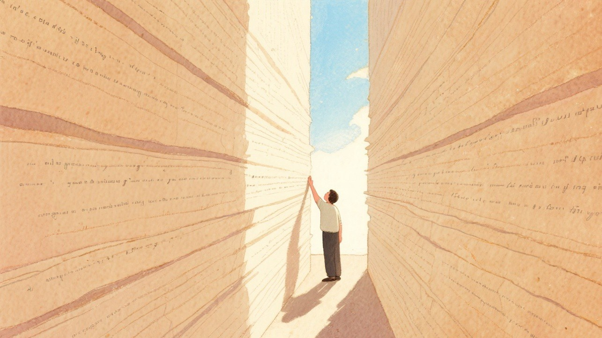
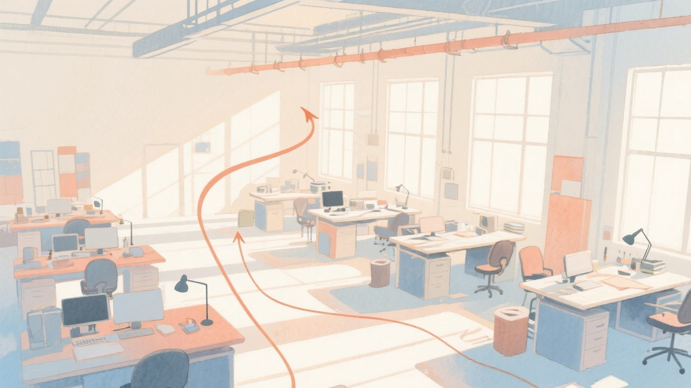

# 为什么你的AI写不出好文章？

*从Prompt工程到认知卸载，问题在架构*


你有没有过这种体验。

同样的ChatGPT，别人用它写出一篇10万+的爆款文章，你用它写了三小时，产出一堆正确的废话。

你开始怀疑是不是自己的prompt不够好，于是去搜各种提示词教程，从简单的「帮我写一篇文章」一路升级到3000字的超长prompt，里面塞满了角色设定、输出格式、语气要求、禁忌清单。

结果呢，文章确实比以前工整了，但读起来还是一股AI味。

我也有过一模一样的经历。去年我开始用AI辅助写公众号文章，一开始觉得太爽了，效率翻了十倍不止。我自己也还在摸索这个边界，但很快我发现一个让我后背发凉的事。

**离开AI之后，我发现自己不会写了。**

MIT媒体实验室做过一个实验，让两组学生分别用ChatGPT和独立完成写作任务，然后测他们的大脑活跃度。用AI那组，大脑活跃度比独立写作组低了30%。

更扎心的是，停用AI之后，这组学生的记忆留存率只有独立写作组的53%。

心理学管这叫「认知卸载」，就是把脑子该干的活外包给工具。短期看效率飙升，长期看你的大脑在偷懒，而且偷懒的程度比你想象的大得多。

你用导航不就是认知卸载吗。不用记路了，效率确实高，但关掉导航之后，你发现自己连常去的超市都找不到入口。写作也一样，你把构思、组织语言、调整节奏这些活全交给AI，大脑对应的区域就越来越懒。

滑铁卢大学心理学家Evan Risko的研究也印证了这一点。他说AI能卸载写作、策略设计这些高阶抽象任务，但这类卸载更容易形成「思维惰性」。重度用户自己都坦言，没有AI，不知道怎么解决问题。


但这还不是最让人焦虑的。

更可怕的是，整个内容生态正在被AI生成的垃圾淹没。有个数据挺触目惊心的，AI内容农场网站从49个膨胀到614个，只用了8个月，增幅12倍。100块钱就能批量生产10万篇文章。

这些文章有个共同特征，西南大学教授刘明华给它们起了个名字叫「AI新八股」。结构固化，正确的空话，内容同质化。你刷十篇AI写的行业分析，感觉像在看同一篇文章换了十层皮。

ICLR 2026的评审危机也说明了这个问题。投稿量接近2万篇，平均分从5.12跌到了4.2。研究发现21%的评审是AI生成的，AI生成内容占比越高，评审质量越差。

连Sam Altman都公开承认，GPT-5.2在写作能力上「搞砸了」。因为团队把算力资源倾斜给了推理和编码，牺牲了写作。

你看，连做AI的人都觉得写作不重要。那我们这些用AI写作的人，是不是该重新想想自己的路。其实吧，想明白了也就那么回事。



说到这个，我自己的踩坑过程特别典型。

最开始用AI写文章，prompt就一句话，「帮我写一篇关于AI写作的文章」。产出的东西嘛，你懂的，结构工整但味同嚼蜡。怎么说呢，就像AI在替你写一份你根本不想看的报告。

然后我就开始了prompt军备竞赛。加角色设定，加输出格式，加语气要求，加禁忌清单。最夸张的时候，我的prompt写了快3000字，比文章本身还长。

效果确实有提升，从60分提到了75分左右。

但再往上就卡住了。

不管我怎么调prompt，文章就是突破不了那个天花板。该有的AI味一点没少，该缺的个人色彩一点没多。我花了大量时间在prompt上反复打磨，收益却越来越小。

后来我才想明白，这就像你给一辆自行车装了最好的座椅、最高级的铃铛、最漂亮的车筐，但它还是一辆自行车。你不可能通过优化零件让自行车跑出汽车的速度。

**单点优化是有天花板的。**

那怎么办呢。

我后来摸索出了一条路，把AI写作分成了三个层级。

**第一层，Prompt工程。** 就是写更好的提示词。这一层大家都在做，从简单指令到超长prompt，从零散指令到结构化模板。市面上能搜到的六大经典提示词框架，ICIO、BROKE、CRISPE、CO-STAR、APE、RACE，全都是在这一层打转。

有用吗，有用。从60分到75分，提升很明显。

但边际递减也特别明显。75分到80分，你要花十倍力气。80分到85分，几乎靠运气。因为prompt工程解决的是「怎么跟AI说清楚你要什么」的问题，但它解决不了「AI能不能稳定产出好内容」的问题。

AI本身有天花板。它没有真实体验，没有持续经历的生活，没有被某件事困扰的真实状态。再好的prompt，也无法让AI凭空产生它没有的东西。

**第二层，工作流设计。** 不再指望一个prompt搞定一切，而是把写作拆成多个步骤，每一步用不同的prompt。

打个比方，第一层像一个人包揽所有活，第二层像一个编辑部协作。有人负责选题，有人负责写稿，有人负责审校。分工明确，产出自然更稳定。

我自己现在写文章基本都在用这一层。先让AI出角度和框架，我来拍板，再让它分段写初稿，最后我来做终审和风格调整。效率没降多少，质量从75分提到了85分左右。

Google DeepMind的Dramatron工具也是这个思路。它让AI做编剧的助手，负责推演剧情和生成对话，但创意方向必须由人类主导。他们管这叫「作者在回路」，AI是热情但略显幼稚的助手，你才是导演。

但这一层也有问题。每次都要手动协调多个步骤，人还是瓶颈。你累了、疏忽了，质量就波动。今天状态好，文章能到85分，明天状态差，可能就掉到70分。我自己也踩过这个坑，深有体会。

**第三层，系统架构。** 把评审规则、质量标准、协作流程全部编码成可自动执行的规则体系，让多个AI智能体各司其职，像一条流水线一样稳定产出。

这一层听着抽象，我拿自己正在用的系统举个例子。

我搭了一套叫KZCQL的多智能体写作系统。写一篇文章，不是一个人对着ChatGPT聊天，而是经过一整套流程。有专门做调研的Agent，有专门挖掘角度的Agent，有负责初稿的Agent，有做事实核查的Agent，还有做全量评审的Agent。

每个Agent手里都有一套明确的规则。评审Agent有12个评分维度，从标题质量到AI味检测，逐项打分。初稿质量从最初的74分一路提到了96分。

这个系统跑起来之后，我最大的感受是，我终于不用每次都从零开始了。规则沉淀下来了，质量标准统一了，每次产出都在一个稳定的水平线上。这种感觉太爽了，真的。

**从一个人写，到一个系统生产。**


说到这里，我想借一个别的领域的类比。

工业生产经历过三个阶段。第一阶段是手工作坊，一个工匠从头到尾做一件产品，质量完全取决于个人手艺。第二阶段是流水线，把工序拆分成标准化的步骤，每个工人负责一道工序，效率和稳定性大幅提升。第三阶段是智能工厂，用自动化系统和机器人协作，质量可控、产能稳定、持续迭代。

AI写作现在也正在经历同样的演进。

Prompt工程就是手工作坊阶段，质量全凭你的prompt功力。工作流设计是流水线阶段，分工明确但还需要人盯着。系统架构是智能工厂阶段，规则编码、自动执行、持续优化。

很多人现在还停留在第一阶段，拼命优化prompt，就像一个工匠在拼命磨自己的工具，却从来没想过建一条流水线。

我不是说prompt不重要。手艺永远重要。但如果你想让产出从「看运气」变成「可预期」，架构设计是绕不过去的坎。很多朋友可能不知道，这个思路其实在很多领域已经被验证过了。

黄仁勋说过一句话我觉得特别准，AI是创意的执行者而非发起者。若社会失去新想法，AI的效率提升将直接转化为失业。

所以关键问题从来不是「怎么让AI写更好」，而是「怎么让AI帮你更好地思考」。

**工具决定上限，架构决定下限。**



回到开头那个问题。为什么同样的AI工具，有人能写出好文章，有人只能生成废话。

区别不在于谁的prompt更长，而在于谁把写作当成一个系统工程来对待。

如果你也用AI写过内容，但总觉得差点意思，问题可能不在你的prompt，而在你的架构。

下一篇我会完整分享这套多智能体写作系统是怎么搭的，从规则设计到Agent协作，每一步都会讲到。关注我不迷路。

**写作的对手从来不是AI，是你自己的生产方式。**

```json
{
  "agent": "W1",
  "article": "AI写作架构",
  "round": 1,
  "timestamp": "2026-05-26",
  "file_path": "04_工作区/产出归档/20260526_AI写作架构/稿件/AI写作架构_v1.md",
  "pre_writing_checklist_completed": true,
  "pre_writing_checklist_details": {
    "Q1_article_prototype": "P5 问题拆解",
    "Q2_case_direction": "个人AI写作踩坑经历+KZCQL系统实践+工业生产类比",
    "Q3_opening_preference": "好奇心驱动+场景代入",
    "Q4_target_reader": "有AI使用经验但遇到瓶颈的创作者",
    "Q5_length_expectation": "3000字以内"
  },
  "key_findings": ["AI写作问题分三层：Prompt工程边际递减、工作流设计分工提效、系统架构稳定产出", "认知卸载是AI写作的隐性代价，长期依赖会导致大脑活跃度下降30%", "从手工作坊到智能工厂的类比揭示了AI写作的必然趋势"]
}
```
