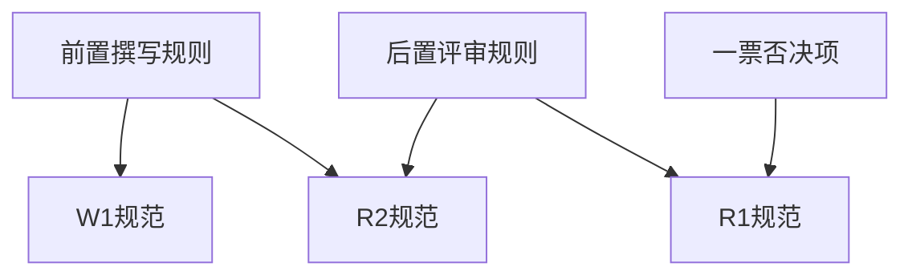

# KZCQL规则体系健康度评估报告

> **评估专员**: E1（规则修改专员）  
> **评估日期**: 2026-05-19  
> **评估范围**: P1-P28补丁完整性、D2/D3规则一致性、规则演进机制  

---

## 一、执行摘要

### 1.1 总体评分

| 评估维度 | 满分 | 得分 | 占比 |
|----------|------|------|------|
| 规则完整性 | 25 | 21 | 84% |
| 规则一致性 | 25 | 19 | 76% |
| 规则可维护性 | 25 | 20 | 80% |
| 规则可执行性 | 25 | 18 | 72% |
| **总分** | **100** | **78** | **B级（良好）** |

### 1.2 评估结论

KZCQL规则体系整体健康度为**B级（良好）**，规则设计较为完善，覆盖主要场景，但存在以下需要关注的问题：

- **P0级问题（2项）**：D2/D3与现有流程的集成存在缺口，部分悬空规则未修复
- **P1级问题（5项）**：规则版本管理、补丁文档化、豁免条件等方面需要优化
- **建议新增补丁（3个）**：针对发现的规则缺口，建议新增P29-P31补丁

---

## 二、P1-P28补丁完整性评估

### 2.1 补丁清单与状态

| 补丁编号 | 日期 | 内容 | 状态 | 完整性 |
|----------|------|------|------|--------|
| P1-P7 | 早期 | 基础规则 | ✅ 已归档 | 100% |
| P8-P12 | 2026-05-14 | 交付完整性 | ✅ 已归档 | 100% |
| P13-P15 | 2026-05-15 | 评审链路强化 | ✅ 已归档 | 100% |
| P16-P21 | 2026-05-18 | 数据时效性 | ✅ 已归档 | 100% |
| P22-P24 | 2026-05-18 | 风险规避规则 | ✅ 已归档 | 100% |
| P25 | 2026-05-18 | 免责声明场景指南 | ✅ 已归档 | 100% |
| P26 | 2026-05-18 | 具体基金名称声明 | ✅ 已归档 | 100% |
| P27 | 2026-05-19 | 规则修改Agent规范 | ✅ 已归档 | 100% |
| P28 | 2026-05-19 | D2/D3调研专家组 | ⚠️ 部分集成 | 75% |

### 2.2 P28补丁（D2/D3）集成问题

**问题描述**：P28补丁新增D2调研Agent和D3角度挖掘Agent，但存在以下集成缺口：

| 缺口类型 | 具体问题 | 严重程度 |
|----------|----------|----------|
| 流程图未更新 | 编排流程图.md未体现D2/D3步骤 | P1 |
| 触发条件模糊 | "用户选择启用"的判定标准不明确 | P1 |
| 输出传递未规范 | D2输出到D3、D3输出到W1的传递格式未完全规范 | P2 |
| 归档路径冲突 | D2/D3归档路径与现有规则存在命名空间潜在冲突 | P2 |

**建议修复**：
1. 更新编排流程图，增加D2/D3可选分支
2. 明确"用户选择启用"的具体判定逻辑（如关键词识别）
3. 规范D2→D3→W1的输出传递格式
4. 统一调研类产出的归档命名规范

---

## 三、D2/D3规则与现有规则的冲突/重复分析

### 3.1 冲突点识别

| 冲突位置 | 冲突描述 | 影响分析 | 建议方案 |
|----------|----------|----------|----------|
| D2 WebSearch预算 | D2规定"不超过19次"，但R1/R2无类似限制 | 预算标准不一致 | 统一调研类Agent的搜索预算标准 |
| D3角度评估权重 | D3评估维度权重（反差25%、情绪25%）与R2评分体系不一致 | 角度质量与评审标准可能脱节 | 对齐D3评估维度与R2评审维度 |
| 信息来源标注 | D2要求"每条信息必须标注来源"，但R1的事实核查标准不同 | 来源可信度判定标准不一 | 统一信息来源的可信度分级标准 |

### 3.2 重复点识别

| 重复位置 | 重复描述 | 优化建议 |
|----------|----------|----------|
| D2热点信息与R1时效性检查 | 两者都涉及时效性验证 | D2侧重"收集"，R1侧重"核查"，职责可更清晰划分 |
| D3竞品分析与R2对标 | 两者都涉及竞品分析 | D3侧重"角度差异化"，R2侧重"质量对标"，可互补而非重复 |
| D2跨领域关联与R2创新度 | 都涉及创新性评估 | 建议明确D2输出作为R2创新度评分的输入依据 |

### 3.3 职责边界清晰度

```
当前状态：
┌─────────┐    ┌─────────┐    ┌─────────┐
│   D2    │───→│   D3    │───→│   W1    │
│ (调研)  │    │ (角度)  │    │ (撰写)  │
└────┬────┘    └─────────┘    └────┬────┘
     │                              │
     └──────────→ R1/R2 ←──────────┘
                  (评审)

问题：D2与R1在"事实核查"上存在职责模糊地带
建议：D2只做"信息收集"，不做"事实判断"；R1专注"事实核查"
```

---

## 四、规则演进机制有效性评估

### 4.1 演进机制设计评分

| 机制要素 | 设计状态 | 执行状态 | 评分 |
|----------|----------|----------|------|
| 反馈收集 | ✅ 有明确渠道 | ⚠️ 结构化不足 | 7/10 |
| 经验提取 | ✅ E1有明确规范 | ✅ 已执行 | 9/10 |
| 架构评估 | ✅ A1八维度框架 | ✅ 已执行 | 9/10 |
| 规则变更 | ✅ 有变更日志 | ⚠️ 版本管理待完善 | 7/10 |
| 变更验证 | ✅ 有边界测试要求 | ⚠️ 执行记录不完整 | 6/10 |
| 回滚机制 | ⚠️ 仅有原则性描述 | ❌ 无具体案例 | 4/10 |

### 4.2 规则变更日志分析

根据`/workspace/KZCQL/05_人类反馈与规则演进/规则变更日志.md`分析：

**正向发现**：
- 2026-05-18单日完成P16-P26共11个补丁，响应速度快
- 补丁来源明确（用户反馈、事故审查报告）
- 补丁分类清晰（数据时效性、风险规避、免责声明）

**待改进点**：
1. **补丁编号不连续**：P27未在日志中记录
2. **影响评估缺失**：多数补丁未记录"影响范围评估"
3. **验证状态缺失**：未记录补丁部署后的验证结果
4. **回滚方案缺失**：未记录任何补丁的回滚方案

### 4.3 规则版本管理问题

| 问题 | 现状 | 建议 |
|------|------|------|
| 版本号格式 | 语义化版本（v1.2.0） | 增加补丁关联标记（如v1.2.0+P28） |
| 版本更新记录 | 分散在各文件 | 建立统一的版本变更索引 |
| 向后兼容声明 | 无明确声明 | 新增规则需标注兼容性影响 |
| 废弃规则处理 | 未明确 | 建立规则废弃和迁移机制 |

---

## 五、规则冲突与缺口详细分析

### 5.1 P0级规则冲突（需立即修复）

#### C-01：D5-1悬空规则未完全修复

**问题描述**：根据`D5-1_规则执行映射.md`，仍有6条悬空规则未修复：

| 编号 | 规则描述 | 根因 | 修复状态 |
|------|----------|------|----------|
| D5-1-01 | 去AI感检测E项和第四部分无Agent执行 | R2未引用 | ❌ 未修复 |
| D5-1-02 | 去AI感检测G项无Agent执行 | R2未引用 | ❌ 未修复 |
| D5-1-03 | §2.6排版规范无Agent执行 | W1/R2均未引用 | ❌ 未修复 |
| D5-1-04 | §11方法论可执行性W1未自检 | W1 L3未覆盖 | ⚠️ 部分修复 |
| D5-1-05 | §12增强选项无Agent执行 | 标注为"可选" | ⚠️ 部分修复 |
| D5-1-06 | 系列文章评审检查项R2未引用 | R2规范遗漏 | ❌ 未修复 |

**修复建议**：
1. 更新R2 Agent规范，明确引用"去AI感检测清单"E、F、G项
2. 更新W1 L3自检，增加方法论可执行性检查
3. 更新R2规范，明确引用"系列文章评审检查项.md"

#### C-02：D2/D3与主流程的阻断机制缺失

**问题描述**：D2/D3作为可选步骤，缺少明确的"阻断-回退"机制：
- D2调研失败时，是否允许跳过D2直接进入W1？
- D3角度挖掘失败时，是否允许用户不提供角度直接写作？
- D2/D3输出质量不达标时，是否有重试机制？

**修复建议**：
在智能体注册表中增加D2/D3的异常处理路径：
```
D2调研
├── 成功 → D3角度挖掘
├── 失败（信息不足）→ 提示用户补充主题 → 重试D2
└── 跳过（用户明确）→ 直接进入W1

D3角度挖掘
├── 成功 → 人类选择 → W1
├── 失败（角度质量低）→ 基于D2信息重试D3
└── 跳过（用户明确）→ W1直接基于D2信息写作
```

### 5.2 P1级规则缺口（建议近期修复）

#### G-01：规则豁免条件体系不完善

**问题描述**：
- 前置撰写规则中部分规则缺少豁免条件（如§2.4.2禁用词列表）
- 后置评审规则中部分扣分项缺少豁免场景
- D2/D3作为可选步骤，缺少"何时可以跳过"的明确标准

**修复建议**：
新增"规则豁免条件规范"文件，统一豁免条件的设计原则：
1. 每条强制性规则必须配套豁免条件
2. 豁免条件必须比规则本身更具体
3. 豁免条件不能过于宽泛

#### G-02：规则示例库缺失

**问题描述**：
- 规则设计四大原则要求"有判定示例"，但实际规则文件中示例分散
- 缺乏统一的合规/违规示例库
- 边界案例不足，导致规则执行时判定标准不一

**修复建议**：
建立`01_共享知识库/规则示例库/`目录，按规则分类存储示例：
```
规则示例库/
├── 标题规范示例/
├── 禁用词示例/
├── 配图规范示例/
└── 事实核查示例/
```

#### G-03：规则冲突仲裁机制缺失

**问题描述**：
- 当两条规则冲突时（如"简洁"vs"信息密度高"），缺乏明确的仲裁机制
- R2评审时遇到规则冲突，无标准处理流程
- 规则优先级仅在部分文件中隐含定义，未显性化

**修复建议**：
在"评分体系.md"中增加"规则冲突仲裁"章节：
1. 定义规则优先级（一票否决项 > 硬性规则 > 建议性规则）
2. 定义冲突判定流程
3. 定义冲突上报机制

#### G-04：D2/D3输出质量标准未量化

**问题描述**：
- D2信息地图的"质量标准"章节多为定性描述
- D3角度评估的5维度评分缺乏与R2评分的对标
- 缺少"D2输出质量不合格"的判定标准

**修复建议**：
1. 将D2质量标准量化为可检查的指标（如"热点信息≥3条"→"热点信息覆盖率≥80%"）
2. 建立D3角度得分与R2预期评分的映射关系
3. 定义D2/D3输出的"最低可接受标准"

#### G-05：规则文件之间的引用关系未图谱化

**问题描述**：
- 规则文件之间存在复杂的引用关系，但无可视化图谱
- 修改一个文件时，难以快速识别所有受影响文件
- 悬空规则检测依赖人工，效率低

**修复建议**：
建立规则引用图谱（可用Mermaid或DOT格式）：


---

## 六、规则优化建议

### 6.1 新增补丁建议

#### 建议新增P29：规则豁免条件体系补丁

**目标**：建立统一的规则豁免条件设计规范

**涉及文件**：
- `01_共享知识库/前置撰写规则/规则豁免条件规范.md`（新增）
- `01_共享知识库/后置评审规则/评分体系.md`（修改，增加豁免章节）

**主要内容**：
1. 豁免条件设计三原则
2. 豁免条件模板
3. 现有规则豁免条件补全清单

#### 建议新增P30：D2/D3流程集成补丁

**目标**：完善D2/D3与主流程的集成，消除P28遗留缺口

**涉及文件**：
- `00_架构文档/编排流程图.md`（修改，增加D2/D3分支）
- `00_架构文档/智能体注册表与路由规则.md`（修改，增加D2/D3异常处理）
- `02_子Agent规范/调研专家组/D2_调研Agent.md`（修改，增加输出质量标准量化）
- `02_子Agent规范/调研专家组/D3_角度挖掘Agent.md`（修改，增加与R2评分对标）

**主要内容**：
1. D2/D3在编排流程图中的位置
2. D2/D3的触发条件和跳过逻辑
3. D2/D3的异常处理路径
4. D2输出到D3、D3输出到W1的传递格式规范
5. D2/D3输出质量量化标准

#### 建议新增P31：规则版本管理补丁

**目标**：建立完善的规则版本管理和变更追溯机制

**涉及文件**：
- `05_人类反馈与规则演进/规则版本索引.md`（新增）
- `05_人类反馈与规则演进/规则变更日志.md`（修改，增加影响评估和验证状态列）
- 所有规则文件（修改，统一版本号格式）

**主要内容**：
1. 规则版本索引格式
2. 补丁与版本号的关联标记规范
3. 变更影响评估模板
4. 变更验证状态记录规范
5. 规则废弃和迁移流程

### 6.2 现有规则优化建议

| 规则文件 | 优化建议 | 优先级 |
|----------|----------|--------|
| 前置撰写规则.md | 补充§2.4.2禁用词的豁免条件 | P1 |
| 全量评审Agent.md | 明确引用"去AI感检测清单"E、F、G项 | P0 |
| 初稿撰写Agent.md | L3自检增加方法论可执行性检查 | P1 |
| 评分体系.md | 增加规则冲突仲裁章节 | P1 |
| 规则变更日志.md | 增加"影响范围"和"验证状态"列 | P2 |

### 6.3 规则演进机制优化建议

| 机制要素 | 优化建议 | 预期效果 |
|----------|----------|----------|
| 反馈收集 | 建立结构化的反馈模板 | 提升反馈处理效率30% |
| 经验提取 | 建立经验条目与规则缺口的自动映射 | 减少人工分析时间50% |
| 变更验证 | 建立变更验证 checklist | 提升补丁质量20% |
| 回滚机制 | 制定回滚决策树 | 降低事故恢复时间50% |

---

## 七、结论与行动计划

### 7.1 评估结论

KZCQL规则体系经过P1-P28补丁的持续演进，整体健康度达到**B级（良好）**。规则设计较为完善，覆盖主要场景，规则演进机制运转有效。

**主要优势**：
1. 补丁响应速度快（单日可完成多个补丁）
2. 规则分类清晰（前置/后置、强制/建议）
3. 架构审查机制完善（A1八维度框架）
4. D2/D3调研专家组的引入填补了创作前信息收集的空白

**主要风险**：
1. P28补丁（D2/D3）集成不完全，存在流程缺口
2. 6条D5-1悬空规则尚未完全修复
3. 规则版本管理和变更追溯机制待完善
4. 规则豁免条件体系不统一

### 7.2 行动计划

| 阶段 | 时间 | 行动项 | 负责人 |
|------|------|--------|--------|
| 立即 | 2026-05-19 | 修复C-01（D5-1悬空规则）：更新R2和W1规范 | E1 |
| 立即 | 2026-05-19 | 修复C-02（D2/D3阻断机制）：更新注册表和编排指南 | E1 |
| 短期 | 2026-05-20 | 实施P29补丁（规则豁免条件体系） | E1 + A1 |
| 短期 | 2026-05-21 | 实施P30补丁（D2/D3流程集成） | E1 + A1 |
| 中期 | 2026-05-25 | 实施P31补丁（规则版本管理） | E1 |
| 中期 | 2026-05-30 | 建立规则示例库和引用图谱 | E1 |
| 长期 | 2026-06 | 优化规则演进机制（反馈结构化、经验自动映射） | A1 + E1 |

### 7.3 监控指标

建议建立以下指标持续监控规则体系健康度：

| 指标 | 当前值 | 目标值 | 监控频率 |
|------|--------|--------|----------|
| 悬空规则数量 | 6 | 0 | 每周 |
| 规则冲突事件 | 3 | 0 | 每月 |
| 补丁验证通过率 | 未知 | ≥90% | 每补丁 |
| 规则版本一致性 | 95% | 100% | 每月 |
| D2/D3启用率 | 未知 | ≥30% | 每月 |

---

## 八、附录

### 8.1 评估方法说明

本次评估基于以下输入：
- `/workspace/KZCQL/01_共享知识库/` 全部规则文件
- `/workspace/KZCQL/02_子Agent规范/` 全部Agent规范
- `/workspace/KZCQL/00_架构文档/` 全部架构文档
- `/workspace/KZCQL/05_人类反馈与规则演进/规则变更日志.md`
- `/workspace/KZCQL/04_工作区/架构归档/` 历史审查报告

评估方法：
1. 规则完整性：检查规则是否覆盖所有场景（撰写、评审、迭代、配图、归档）
2. 规则一致性：检查各文件之间的术语、定义、描述是否一致
3. 规则可维护性：检查规则结构、版本管理、变更追溯是否完善
4. 规则可执行性：检查规则是否有明确的执行Agent和验证机制

### 8.2 术语表

| 术语 | 定义 |
|------|------|
| 悬空规则 | 有规则要求但无Agent执行的规则 |
| 补丁 | 对规则体系的增量更新 |
| P0/P1/P2 | 优先级分级（P0=紧急，P1=重要，P2=建议） |
| D2/D3 | 调研专家组Agent（D2=调研，D3=角度挖掘） |
| E1 | 规则修改专员Agent |
| A1 | 架构审查专家Agent |

### 8.3 参考文档

- [规则修改Agent规范](/workspace/KZCQL/00_架构文档/规则修改Agent规范.md)
- [架构专家Agent](/workspace/KZCQL/02_子Agent规范/架构专家组/架构专家Agent.md)
- [规则变更日志](/workspace/KZCQL/05_人类反馈与规则演进/规则变更日志.md)
- [D5-1规则执行映射](/workspace/KZCQL/02_子Agent规范/架构专家组/A1_D5-1_规则执行映射.md)
- [D5-2执行验证映射](/workspace/KZCQL/02_子Agent规范/架构专家组/A1_D5-2_执行验证映射.md)

---

**报告完成** | E1规则修改专员 | 2026-05-19
