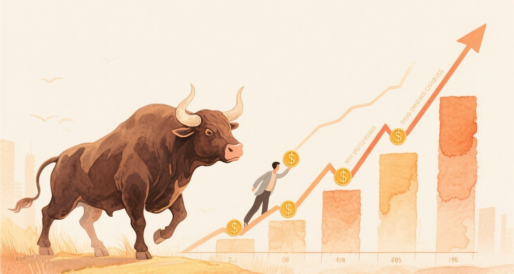
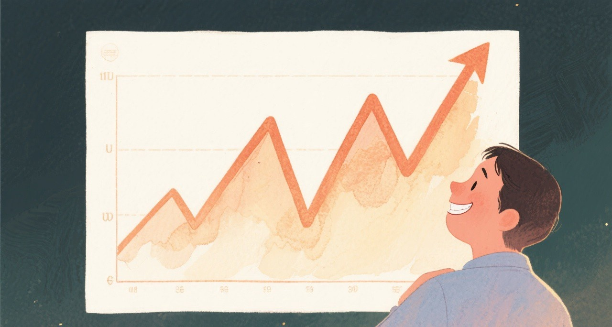
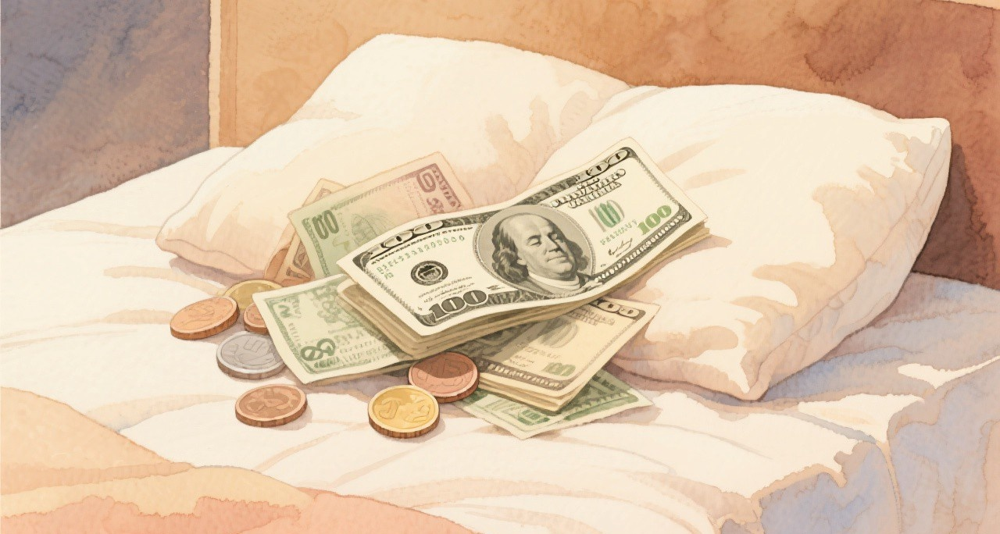
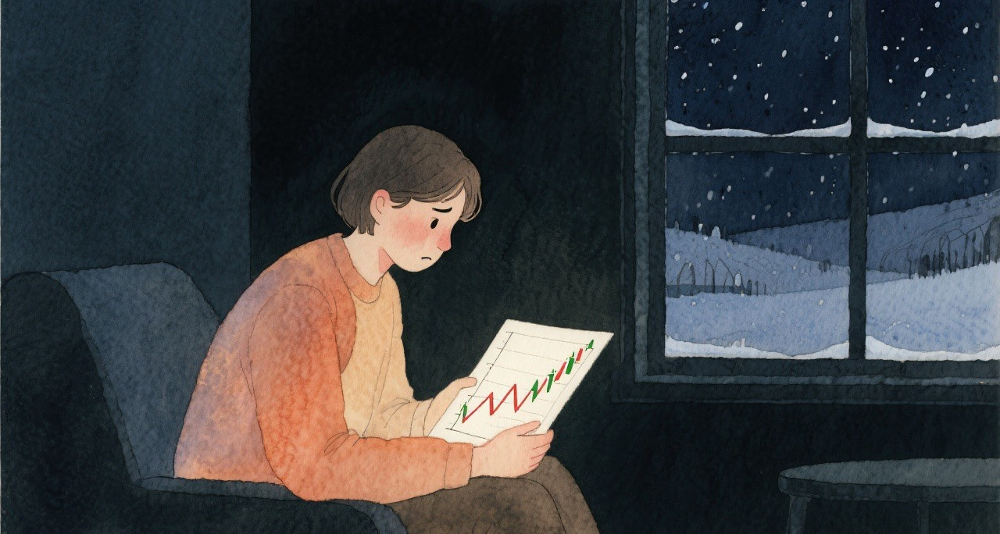

# 定投的7个坑，我全踩过

上期我说定投是最适合普通人的方法，其实吧，它也有坑，而且我全踩过。

现在网上把定投吹得太神了。什么「躺赚」「无脑理财」「时间的朋友」，听得我都想笑。定投确实是个好东西，但它不是万能药，该踩的坑一个都不会少。

今天我想泼盆冷水，聊聊定投的7个致命缺陷。每个坑我都认真研究过，也都有自己的应对方法。

**定投不是保险箱，它只是一种有纪律的买入方式。**

---

**第一个坑，单边牛市里的「收益拖累」。**

想象一下这个场景。市场一直在涨，你每个月固定投一笔钱进去。问题是，越投成本越高，最后算下来，收益还不如一开始一把梭哈的人。

假设2024年初市场开始涨，你每个月定投500块。到年底市场涨了30%，你的成本也被一路拉高。那些一开始就all in的人，赚的是完整的30%。你呢？可能只有15%左右。

这种感觉挺憋屈的。明明坚持了纪律，结果反而少赚了。

我有时候会想，如果我能预知市场走势，那肯定一把梭哈收益最高。但问题是，谁能预知呢？那些all in的人，如果市场不是涨而是跌，他们的亏损也是完整的30%。

定投的「收益拖累」，其实就是用一部分潜在收益换取风险控制。你放弃了在牛市里赚最多的机会，但也避免了在熊市里亏最惨的风险。

但换个角度想，这个「防守成本」其实是必须付的。为啥？因为你手里的钱是增量资金，每个月才到账500块，你根本没有梭哈的条件。就算你知道市场要涨，你也只能一个月一个月地投。

所以应对这个坑的方法很简单，承认它的存在。定投本来就不是为了赚最多，而是为了在不确定的市场里，用纪律保护自己。

而且对于咱们这种每月只有500到2000元可支配资金的学生或者职场新人来说，即使想梭哈也没那个本金。定投恰恰是最适合增量资金的策略，它把你的现金流自动转化为投资，不需要你一次性拿出一大笔钱。

**在牛市里少赚一点，是定投必须支付的「保险费」。**

---

**第二个坑，叫「钝化效应」。**

这是我自己研究定投一年多之后才发现的问题。

假设一下，刚开始定投的时候，每个月投500块，对本金的摊薄效果很明显。比如你投了3个月，总共1500块，第四个月再投500，相当于增加了33%的新资金，能显著拉低成本。

但等你投了两年，本金积累到5000块的时候，每个月新增的500块只占10%不到。这时候同样的定投金额，对整体成本的影响就小了很多。

这就是钝化效应。本金大了之后，小额定投的威力会大幅下降。

打个比方，就像你往一杯水里加糖，第一勺糖味道变化很明显，但加到第十勺的时候，再加一勺基本尝不出区别。

我现在的应对方法是做资产再平衡。简单说，就是当股债比例偏离目标太远的时候，手动调回来。

不过我目前还没真正做过再平衡。为啥？因为我现在的股票占比才12%左右，离我设定的触发线还很远。我给自己定的规则是，股票资产占比达到80%以上的时候，强制再平衡回40%到50%。但目前这个条件根本没触发过，所以我一直是纯机械化定投，没有任何主动操作。

很多人可能会觉得，12%的股票占比太低了，大部分钱都在债基里，收益肯定上不去。但我觉得吧，这恰恰是定投初期该有的状态。

为啥？因为我刚开始定投不久，本金本来就小，风险承受能力也有限。如果一上来就把大部分钱投进股市，万一遇到大跌，心态很容易崩。现在12%的股票占比，相当于用一小部分钱去「试水」，大部分资金放在债基里求稳，这样即使股市波动，整体账户也不会大起大落。

我每个月投500块，其中400块进宽基指数，100块进卫星仓位，慢慢积累。随着本金增长，股票占比自然会慢慢提高。等哪天股票占比真的涨到了80%的触发线，说明我的本金已经积累到一定程度了，那时候再做再平衡也不迟。

而且说真的，再平衡这件事，说起来容易做起来难。它要求你在市场涨得好的时候主动卖出股票，在市场跌的时候主动买入股票。这跟人性的贪婪和恐惧是反着的。所以我觉得，与其频繁操作，不如定好一个硬触发条件，到了就执行，不到就不动。这样至少不会被情绪带着走。

---

**第三个坑，是让人绝望的「苦笑曲线」。**

你可能听过「微笑曲线」，就是市场先跌后涨，定投在低位积累了大量筹码，最后涨起来的时候收益很可观。这是定投最理想的情况。

但还有另一种走势，叫「苦笑曲线」。市场先涨后跌，你在高位积累了大量筹码，最后在低位被套牢。

假设一下。你开始定投后，市场一路上涨，你每个月都在买，越买越贵。半年后你投了3000块，成本被拉得很高。结果市场开始跌，你的3000块迅速变成2500、2000...

这时候你看着账户里的浮亏，心态很容易崩。你可能会想，早知道应该在高点卖掉。但问题是，你怎么知道那是高点？

苦笑曲线最可怕的地方在于，它会让你怀疑定投这个策略本身。你会想，定投是不是骗人的？为什么坚持了纪律，结果还是亏钱？

应对苦笑曲线，我有两个策略。

第一，建立止盈机制。我的卫星仓位（AI和军工那部分）设了一个止盈线，持有收益率达到30%就触发。具体操作是先卖出50%的持仓，资金转入债基。剩下的50%继续拿着，如果收益率回撤到20%就全部卖出。目前我的AI持仓收益率大概是24%，还没到触发线，所以还在等着。

第二，对核心仓位保持长期主义。沪深300和中证500代表的是中国经济的基本面，我相信长期来看国运是向上的。短期的波动不重要，重要的是坚持积累份额。

**止盈比坚持更难，但这是必须建立的纪律。**

---

**第四个坑，资金利用率低。**

这个问题挺隐蔽的，但确实存在。

你每个月定投500块，但这500块不是一开始就全部投出去的。比如你是每月15号扣款，那月初到15号这段时间，这笔钱就躺在账户里闲置着。

虽然时间不长，可能也就半个月，但积少成多，一年下来也是一笔小钱。假设年化收益3%，500块闲置半个月，损失的收益大概是0.6元。一年12个月，就是7块多。虽然不多，但蚊子腿也是肉。

更重要的是，这种资金闲置反映了一个问题，你的资金配置不够精细。

我的做法是把这笔钱先放到货币基金里，作为「蓄水池」。等扣款日到了，再自动转出来。货币基金虽然收益不高，但流动性好，T+0或者T+1就能到账，而且风险极低。

这样至少能赚个活期利息，虽然不多，但聊胜于无。而且这个过程是自动化的，设置好之后就不管了，不增加额外的操作负担。

---

**第五个坑，「止盈」比「坚持」更难。**

这个坑我差点就踩了。

假设一个场景。你的卫星仓位涨得不错，浮盈接近30%。我当时想，再等等，说不定还能涨。结果年后一波调整，收益直接归零。

这种感觉太难受了。明明曾经赚过，最后却什么都没剩下。

这就是人性的弱点。赚了想赚更多，亏了舍不得割。心理学上叫「损失厌恶」和「锚定效应」。你把最高点当作锚，觉得不到那个点就不卖，结果往往错过最佳卖出时机。

后来我反思，问题出在没有明确的卖出规则。买入的时候有纪律，每月固定投500块，但卖出的时候全凭感觉，这怎么可能做好？

现在我给自己定了机械化止盈纪律，专门针对卫星仓位。

规则很简单，持有收益率达到30%，卖出50%，资金转入债基。剩下的50%继续拿着，但如果收益率回撤到20%，就全部清仓。

为什么是30%？因为卫星仓位本身波动就大，止盈线设太低容易被日常波动震出去，设太高又可能错过卖出机会。30%是我根据自己的风险承受能力定的一个平衡点。

为什么先卖50%而不是全卖？因为如果卖完市场还涨，你只卖了一半，不会太后悔。如果市场跌了，你手里已经锁定了部分利润，剩下的设一个20%的回撤线作为保底。

这个策略的核心思路就是，承认自己无法判断最高点，所以用分批操作来降低后悔的概率。

目前我的AI持仓收益率在24%左右，还没到30%的止盈线。有时候看着收益涨涨跌跌，确实会想提前卖。但纪律的意义就在于此，不到线就不动，到了线就坚决执行。

**有纪律的买入很重要，有纪律的卖出同样重要。**

---

**第六个坑，无法规避「烂资产」风险。**

定投有个前提，你投的东西本身得是好的。如果你定投了一个夕阳产业，或者一只垃圾基金，那越投越亏，越陷越深。

我见过有人定投某只行业基金，投了一年多还在跌。仔细一看，那个行业本身就是下行周期，公司基本面越来越差。这种时候定投就是在填无底洞。

定投能摊薄成本，但不能改变资产的内在价值。如果你投的是一只烂股票，摊薄成本只是让你亏得慢一点，最后还是亏。

我的应对策略是精选宽基指数（跟踪一篮子股票的指数基金，分散风险），避开个股。

我选的是沪深300和中证500。沪深300跟踪的是A股市值最大的300家公司，中证500跟踪的是排名第301到800的公司。这两个指数加起来，覆盖了A股市值最大的800家公司，基本上代表了中国经济的核心资产。

宽基指数有个好处，就是成分股会定期调整。表现差的公司会被踢出去，表现好的公司会被加进来。这样即使个别公司出问题，对整体影响也有限。

相比之下，个股的风险就大得多。一家公司可能因为管理层变动、行业政策变化、竞争格局恶化等各种原因走下坡路。如果你定投的是这种股票，那真的是灾难。

**定投不能把你从烂资产里拯救出来，选对标的才是第一步。**

---

**第七个坑，心理煎熬期极长。**

这可能是定投最大的敌人。

熊市的时候，市场可能跌一年、两年，甚至更久。你每个月看着账户里的浮亏，心态很容易崩。很多人就是在黎明前倒下的，坚持了很久，最后实在受不了，割肉离场。

我自己也经历过这种煎熬。市场震荡的时候，我的股票仓位一度浮亏10%以上。那时候每个月定投，感觉就像往水里扔钱。明明可以停下来，为什么还要继续买？

这种自我怀疑是很正常的。人不是机器，看到账户里的数字一天天变少，不可能完全没有情绪。

后来我做了两件事来帮助自己度过煎熬期。

第一是认知升级，理解「账面亏损」和「份额积累」的区别。浮亏只是数字，只要你没卖出，就不是真亏。而份额积累是实实在在的，市场跌的时候，同样的钱能买到更多份额，等涨起来的时候收益会更可观。

我给自己算了一笔账。假设市场跌了20%，我的持仓市值从3000变成2400，看起来亏了600块。但实际上，我的基金份额增加了，如果市场回到原来的位置，我的收益会超过之前的3000块。这就是「份额积累」的力量。

第二是建立陪伴机制。我会定期记录自己的投资状态，写一些笔记。比如每个月定投之后，记录下当月的净值、累计投入、累计份额。回头看的时候，能看到自己是怎么一步步走过来的，这种仪式感能帮助我坚持。

我的笔记格式很简单，就是几行字，日期、投入金额、当前市值、累计份额、心情指数。心情指数用1到5分表示，1分是很慌，5分是很淡定。回头看的时候，你会发现一个有趣的现象，往往心情最低谷的时候，就是市场的最低点。这时候如果能坚持住，后面的收益会很可观。

有时候我也会看看历史上的熊市数据。A股历史上最长的熊市大概持续了4年左右，但之后都迎来了反弹。只要我相信中国经济长期向好，短期的波动就不应该让我恐慌。

还有一个方法，就是找几个也在定投的朋友，互相打气。一个人坚持很难，但一群人坚持就容易多了。大家可以定期交流一下投资心得，分享一下各自的操作。这种社交属性能够大大增强你的执行力。

**定投最难的不是策略，而是在漫长熊市里保持心态稳定。**

---

聊完这7个坑，你可能会觉得，定投这也问题那也问题，还能不能投了？

我的答案是，能投，但要清醒地面对这些缺陷。

定投确实有缺陷，但每个缺陷都有应对方法。核心-卫星策略帮你平衡收益和风险，股债再平衡帮你克服钝化效应，机械化止盈纪律帮你克服人性弱点。

没有任何一种投资方法是完美的。一把梭哈可能在牛市里赚最多，但在熊市里也可能亏最惨。定投放弃了部分收益，换取了更稳健的风险控制。这是一种取舍，没有对错，只有适合不适合。

而且说真的，对于大多数理财新手来说，我们缺的不是一个能让我们暴富的策略，而是一个能让我们坚持下来的策略。定投的意义不在于它能让你赚多少钱，而在于它能让你养成投资的习惯，让你从月光族变成有资产的人。

对我来说，定投最大的价值不是赚多少钱，而是建立了一套纪律化的投资习惯。每个月固定时间、固定金额、固定标的，不需要盯盘，不需要猜涨跌，把精力解放出来去做更重要的事。

我现在主要在忙AI产品经理方面的项目，还在做一些智能体的架构搭建，精力基本都放在这些上面了，根本没有时间天天盯着股市。定投让我可以把投资这件事自动化，不用操心，不用焦虑，每个月自动扣款，自动买入，剩下的时间我可以用来深耕项目、学习新技术、提升自己。

**没有完美的投资方法，只有适合自己的投资方法。**

如果你也是理财新手，每月可支配资金在500到2000元之间，定投确实是一个不错的起点。但请记住，它不是万能的，你需要了解它的缺陷，并准备好应对策略。

下期我想聊聊，怎么搭建自己的定投组合。核心仓位选什么，卫星仓位怎么配，股债比例怎么定，这些具体的问题我们下次细说。

如果你也在定投，或者正准备开始，希望这篇文章能帮到你。点个赞、转发给身边想理财的朋友，他们可能正好需要。

我们下期见。

> *理财新手生存指南 · 第2篇/共12篇*
