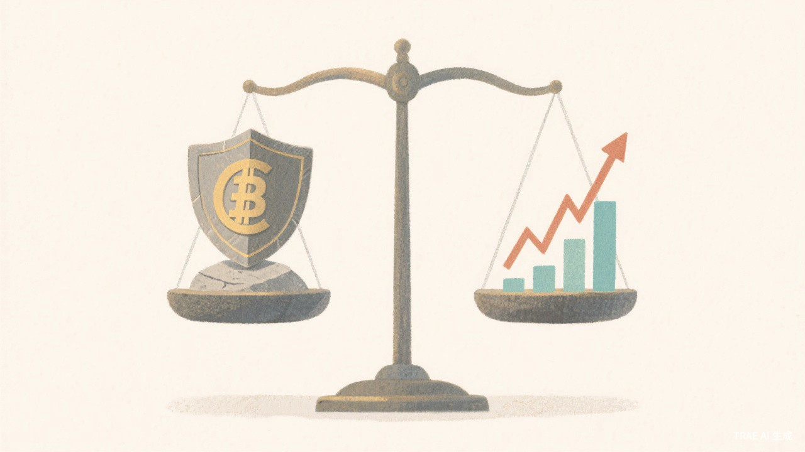

# 先稳后攻，我的理财第一课

上期预告说要聊定投组合，但我想了想，在那之前必须先聊一个更基础的问题。

你可能会觉得，理财嘛，不就是找几只基金定投，然后等着赚钱？事情没那么简单。如果你连自己的钱该怎么分配都没想清楚，定投再多也是盲人摸象。

我今天想聊的，是资产配置，特别是先稳后攻这个逻辑。

其实吧，我一开始也觉得这个话题太 boring 了。什么股债平衡、什么压舱石，听着就像教科书。但真的操作了一年半之后，我发现这才是普通人理财的第一课。不是选什么基金，而是先想清楚，你的钱该怎么放。

**先稳后攻，保住本金比赚钱更重要。**

---

**我的资产配置演进。**

我现在的总资产大概是2.9万，股票基金占12%左右，债基占87%左右。很多人看到这个比例可能会觉得，这也太保守了吧？一个二十多岁的年轻人，怎么敢把将近九成的钱放在债券里？

怎么说呢，这其实是我一步步摸索出来的。

最开始的时候，我全部买的都是债券基金。不是纯债，是一级债，比如易方达兴利180天那种（仅为举例，不构成推荐）。那时候我对股市完全没概念，也不觉得自己有能力去判断哪只股票会涨。我就想，先把本金保住吧，别还没开始赚钱就亏光了。

你可能会觉得，这也太怂了。

但事情是这样的。我当时每个月能拿出来的钱也就500块左右，本金积累得很慢。如果一开始就把这500块全扔进股市，万一遇到大跌，我这点本金直接腰斩，心态肯定崩。而且最关键的是，我那时候对投资几乎一无所知，连沪深300是什么都不清楚。

所以我的策略很简单，先让债基帮我稳住基本盘，同时用小额定投慢慢接触股票基金。

每个月500块，200块投沪深300，200块投中证500，剩下的100块拆成两份，50块投AI主题，50块投军工。这个定投组合我从2024年中开始，到现在差不多一年半了。

结果就是，我的股票占比从0慢慢涨到了现在的12%左右。债基那边虽然收益不高，但胜在稳定，整体账户的波动很小。每个月打开账户看看，基本不会有那种心惊肉跳的感觉，这种踏实感对我来说很重要。

我给自己设了一个长期目标，逐步把股票比例提升到70%甚至80%。但这事急不来，得等本金积累到足够多、对市场的理解足够深之后再说。我现在的心态是，不着急，慢慢来，先把基础打牢。

**这不是保守，这是理性。**

---

**先稳后攻的逻辑。**

很多人可能会问，为什么要这么做？直接全仓股票不是赚得更多吗？

你想想，如果你现在手里有3万块，全仓股票，遇到一波大跌，直接亏掉30%，那就是9000块没了。对于一个月可支配只有500到2000块的普通人来说，9000块可能是半年的积蓄。这种打击，不仅仅是金钱上的，更是心态上的。

我有时候觉得，投资最大的敌人不是市场，是自己的心态。

先稳后攻的核心逻辑其实很简单。稳，就是用债券基金作为压舱石，保护本金。债基的波动很小，即使股市大跌，债基那边也能帮你托住底。攻，就是用定投的方式慢慢积累股票份额，让时间成为你的朋友。

举个例子。假设你的账户里有90%是债基，10%是股票。如果股市跌30%，你的股票部分亏掉30%，但因为只占10%，对整体账户的影响只有3%。这种跌幅，你完全扛得住，心态也不会崩。你甚至可能会想，跌得越多越好，正好可以多买点便宜货。

但如果反过来，你90%是股票，10%是债基，那股市跌30%就意味着整体账户亏掉27%。这种跌幅，很多人就直接割肉离场了，倒在黎明前。更惨的是，有些人会在最低点割肉，然后看着市场反弹，却再也不敢进场了。

**债基压舱石的作用，就是让你在风暴中站得稳。**

---

**为什么普通人需要债券压舱石。**

我认识的很多理财新手，包括我自己刚开始那会儿，都有一个共同的问题，太急了。

急着赚钱，急着看到收益，急着证明自己能选对股票。结果就是，一开户就全仓杀进去，遇到震荡就慌得不行，最后高位接盘、低位割肉，反复被收割。

债券压舱石的意义，不仅仅是降低整体波动，更重要的是给你心理上的安全感。

当你的账户里大部分钱都在债基里稳稳地涨，即使股市那边跌了一点，你也不会太慌。你知道自己的基本盘是安全的，这种心态上的稳定，会让你做出更理性的决策。

而且，债基还有一个隐藏的好处，灵活调仓的空间。

假设股市跌了很多，你觉得是个抄底的好机会，可以用债基里的钱去补仓。当然，这需要纪律，不能随心所欲地操作。但至少你有这个选项，而不是像全仓股票的人那样，只能干瞪眼或者割肉。

我身边就有个反面例子。朋友一开始全仓某只热门股票，遇到调整亏了40%，心态崩了直接割肉离场。结果没过多久那只股票就涨回来了，他完美错过了反弹。如果当时能有一部分钱在债基里托底，可能就不会做出那么冲动的决定。

说真的，债基的存在，就像是给你提供了一个情绪的缓冲带，让你在市场动荡时依然能够保持清醒。

---

**股债平衡的原理。**

说实话，第一次认真研究股债平衡的时候，我也是一头雾水。什么马科维茨投资组合理论、什么有效前沿，看得我直打瞌睡。

但后来我想明白了，其实不用搞那么复杂。股债平衡的核心就一句话：别把鸡蛋放在一个篮子里。股票负责进攻，债券负责防守，两者搭配，才能走得更远。

股债平衡，其实就是股票和债券的比例配置。这个比例得根据你的实际情况动态调整，没有一劳永逸的标准答案。

怎么调整呢？主要看三个因素。

第一个是本金的规模。本金小的时候，债基占比应该高一些，先保住本金再说。等本金积累多了，承受波动的能力变强了，可以逐步提升股票的比例。

第二个是风险承受能力。这个很主观，每个人的情况都不一样。如果你看到账户亏10%就睡不着觉，那你的股票比例就应该低一些。如果你能坦然面对30%的回撤，那可以适当提高股票比例。

第三个是投资期限。如果你这笔钱是三年内要用的，那应该以债基为主，安全第一。如果是十年以上的长期投资，股票的比例可以高一些，因为时间可以平滑掉短期的波动。

这个道理其实很好理解。假设你有一笔钱，明年就要用来交学费或者付房租，那你肯定不能把它放在波动大的股票里。万一明年市场不好，你不得不割肉卖出，那就亏大了。但如果是十年甚至更久以后才用的钱，比如养老金，那短期的波动就不那么重要了，长期来看股票的收益通常会更高。

我的调整策略是这样的。本金小的时候就以债基为主，像我现在这样87%债基、12%股票。等本金积累到10万、20万的时候，再逐步把股票比例提升到50%、60%。最终目标是70%到80%的股票，但那可能是五年甚至十年后的事了。

当然，这个比例不是一成不变的。比如我设定目标比例是70%股票+30%债基，但如果遇到一波大牛市，股票涨得太猛，占比超过了80%，那我就会强制进行再平衡，卖出一部分股票、买入债基，把比例调回到目标区间。

这里要区分两个概念：**目标比例**是我希望长期保持的股债配比，**再平衡线**则是为了防止单一资产过度膨胀而设的警戒线。这些调整都有明确的触发条件，拍脑袋可不行。不过到目前为止，这条线从未触发过，毕竟我现在只有12%的股票仓位，离80%还远着呢。

这种机械化的规则很重要，因为它可以帮你克服人性的弱点。如果没有规则，你很可能会在牛市的时候贪婪，在熊市的时候恐惧。有了规则，你就可以按照既定的计划执行，不被情绪左右。

**股债平衡是一个动态演进的过程，没有终点。**

---

**你的股债比例应该是多少？**

聊到这里，你可能想问了：说了这么多，那我的股债比例到底该怎么配？

我整理了一个简单的对照表，你可以根据自己的情况参考：

| 本金规模 | 风险承受能力 | 投资期限 | 建议股债比例 |
|---------|-------------|---------|-------------|
| 小于5万 | 低 | 3年以内 | 10%股票 + 90%债基 |
| 小于5万 | 中 | 3-5年 | 20%股票 + 80%债基 |
| 5-20万 | 中 | 5年以上 | 40%股票 + 60%债基 |
| 5-20万 | 高 | 5年以上 | 60%股票 + 40%债基 |
| 大于20万 | 高 | 10年以上 | 70%股票 + 30%债基 |

**几点说明：**
- 本金小+风险承受能力低+投资期限短，这三个条件同时满足时，债基占比应该最高
- 随着本金增加、经验积累、投资期限拉长，可以逐步提高股票比例
- 这个比例不是死的，可以根据自己的实际情况微调

**看完这个表，你觉得你现在的股债比例合适吗？欢迎在评论区聊聊你的配置。**

---

**可复用的实践方法。**

如果你也想尝试这种先稳后攻的策略，我整理了几个实用的建议。

首先是资产配置比例的自测。你可以根据自己的情况，大致确定一个初始比例。风险承受能力低、投资经验少、本金规模小的，可以从90%债基+10%股票开始。风险承受能力中等、有一定经验的，可以尝试70%债基+30%股票。只有风险承受能力高、经验丰富、本金充足的，才考虑50%以下的债基占比。

其次是债券基金的筛选。债基也分很多种，纯债、一级债、二级债，区别主要在于能不能投股票。纯债只能投债券，风险最低。一级债可以打新股，风险稍微高一点。二级债可以直接买股票，风险最高。对于新手来说，建议从纯债或一级债开始。

选债基的时候，看几个指标。历史回撤，看看这只基金过去最多亏过多少，如果某一年亏了很多，要看看是什么原因。基金经理，看看他的从业经验和业绩记录，最好选管理这只基金超过三年的经理。基金规模，不要太小，也不要太大，几亿到几十亿比较合适，太小了有清盘风险，太大了操作不灵活。

我个人的建议是，选宽基债基，避开那些小众品种。宽基债基投资范围广，风险分散，更适合普通人。什么是宽基债基呢？就是那种投资范围比较广，不局限于某个特定行业或地区的债券基金。相比之下，有些债基只投某个特定领域的债券，比如只投城投债或者只投地产债，这种风险就比较集中，不适合新手。

**理财这件事，宁可慢一点，也不要走错路。**

我还想补充一点关于止盈的想法。虽然这篇文章主要讲的是资产配置，但止盈也是整个投资体系中很重要的一环。我给自己的卫星持仓（比如AI主题和军工）设了一个止盈线，持有收益率达到30%就触发止盈，卖出50%，剩下的50%设一个20%的回撤线。目前我的AI持仓收益率是24.25%，还没达到止盈线，所以继续持有。

这种规则化的操作，可以让你在获利时不会过于贪婪，在亏损时也不会过于恐惧。投资说到底，是一场与自己情绪的博弈。

---

**写在最后。**

先稳后攻不是保守，而是理性。

作为一个每月可支配只有500到2000块的普通人，我们输不起。一次大的亏损，可能就直接击垮你的投资信心，让你彻底退出这个市场。但如果你能稳住基本盘，用小额定投慢慢积累，时间会成为你最好的朋友。

我知道，很多人可能会觉得，我这种策略太保守了，年轻人就应该激进一点，全仓股票搏一把。我理解这种想法，毕竟年轻就是资本，有时间去承受波动。但问题是，如果你一开始就输光了本金，你还拿什么去搏？

投资不是赌博，不是一夜暴富的游戏。它是一个长期的、复利的过程。巴菲特99%的财富是在50岁之后赚到的，这就是复利的力量。但复利的前提是，你得先保住本金，活得够久。

普通人理财的第一课，学会怎么保住本金，比学会怎么赚钱更重要。在这个基础上，再谈增值。

不急于求成，让时间成为朋友。这是我这一年半最大的感悟。

回顾这一年半的投资历程，我最大的收获其实是一套适合自己的投资体系，赚了多少钱反而是次要的。从最初的全仓债基，到现在的股债搭配，每一步都是根据自己的实际情况做出的调整。这个过程中也有过迷茫和犹豫，但坚持先稳后攻的原则，让我在市场波动中始终保持了清醒。

我想对正在看这篇文章的你说，理财没有标准答案，每个人的情况都不一样。但有一些基本原则是通用的，比如保住本金、控制风险、长期持有。找到适合你自己的节奏，比盲目跟风重要得多。

下期我们聊聊怎么筛选具体的基金产品，从海量基金里找到适合自己的那几只。

---

如果你也在摸索理财的路上，希望这篇文章对你有帮助。点个赞、转发给身边同样在理财的朋友，他们可能正好需要。

**最后想问你一个问题：你现在的理财配置中，最让你纠结的是什么？是不知道怎么分配比例，还是选不准具体的产品？欢迎在评论区留言，我会挑选一些典型问题在下期解答。**

我们，下期再见。

> 本文仅供学习交流，不构成投资建议。市场有风险，投资需谨慎。过往业绩不代表未来表现。

> *理财新手生存指南 · 第3篇/共12篇*
